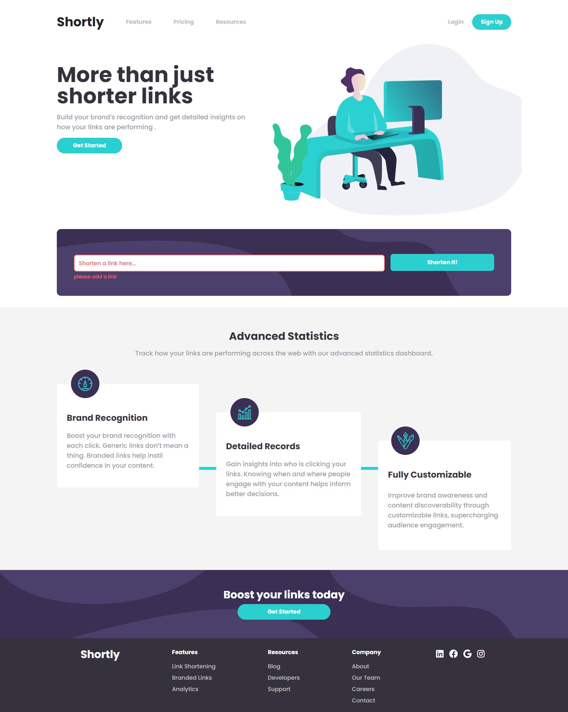

# Frontend Mentor - Shortly URL shortening API Challenge  

This is a solution to the [Shortly URL shortening API Challenge challenge on Frontend Mentor](https://www.frontendmentor.io/challenges/url-shortening-api-landing-page-2ce3ob-G). Frontend Mentor challenges help you improve your coding skills by building realistic projects. 

## Table of contents

- [Overview](#overview)
  - [The challenge](#the-challenge)
  - [Screenshot](#screenshot)
  - [Links](#links)
- [My process](#my-process)
  - [Built with](#built-with)
  - [What I learned](#what-i-learned)
- [Author](#author)

 
## Overview

### The challenge

Users should be able to:

- View the optimal layout for the site depending on their device's screen size
- Shorten any valid URL
- See a list of their shortened links, even after refreshing the browser
- Copy the shortened link to their clipboard in a single click
- Receive an error message when the `form` is submitted if:
  - The `input` field is empty

### Screenshot

### Links

- Solution URL:(https://your-solution-url.com)
- Live Site URL: (https://your-live-site-url.com)

## My process

### Built with

- Semantic HTML5 markup
- CSS  
- Flexbox
- Mobile-first workflow
- Next.js (https://nextjs.org/) - React framework
- Tailwindcss(tailwindcss.com/docs/) - For styles

### What I learned

-starting from mobile view port to desktop ( before i was doing the inverse)
-better manipulating flexbox 
-new positioning ideas . 
-improving my redux skills .
 
 
 
### Continued development

 
 
## Author

- Website - [Aouragh Mohamed El Amine](http://aouraghmed.herokuapp.com/)
- Frontend Mentor - [@Aouragh Mohamed El Amine](https://www.frontendmentor.io/profile/AouraghMohamedElAmine)
- Twitter - [@Amin02941392](https://twitter.com/Amin02941392)

**Note: Delete this note and add/remove/edit lines above based on what links you'd like to share.**

